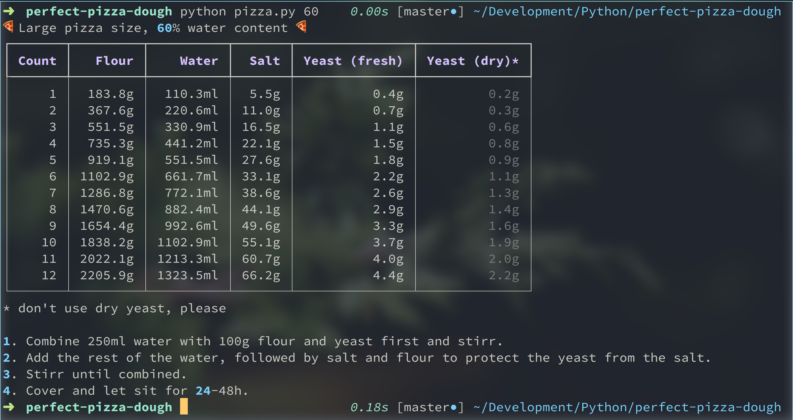

# Perfect Pizza. Everytime.

Combine and wait. No kneading required.

# Usage

`$ python pizza.py <water percentage between 50-70>`

Adjust water percentage depending on your oven temperature:

| 65-70 | Normal oven on max temperature |
| 60    | Gas BBQ                        |
| 57    | Wood Oven                      |

# Requirements

| `pip install rich` | Nicely formatted table print |

